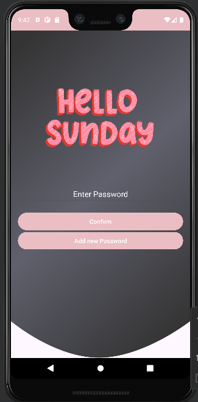

# DairyAppMobile

Welcome to DairyAppMobile, a mobile diary app designed with security and convenience in mind.

## Pages Overview:

1. **Password Verification Page:**
   - Displays unique images for each day.
   - Implements password encryption using the Bcrypt library.
   - Requires existing password validation for adding a new password.
   

2. **Add New Password Page:**
   - Enables users to set and confirm passwords securely.
   - Utilizes SQLite database for password storage.
   - Designed for future multi-user implementation.
   

3. **Homepage:**
   - Features a customizable user view.
   - Utilizes GitHub repository for navigation bar implementation.
   - Provides easy access to adding new tasks, viewing diary entries, and settings.
   

4. **Page for Adding New Tasks:**
   - Allows users to create and store daily tasks with subject, description, images, and date.
   - Utilizes libraries for calendar view, image capture, and gallery access.
   

5. **Page for Viewing the Tasks:**
   - Enables editing and deleting of tasks.
   - Displays activities in descending order by date, with an option to load more entries.
   

6. **Page for Setting:**
   - Allows users to submit username and feedback.
   - Supports backup and restore processes using Firebase storage.
   

## References:
- [Database Connection Tutorial](https://www.youtube.com/watch?v=quIHs8yiOQ8)
- [Calendar View Tutorial](https://www.youtube.com/watch?v=QC9UhvyI18c)
- [GitHub Co-Pilot](https://copilot.github.com/)
- [Firebase Documentation](https://console.firebase.google.com/)

